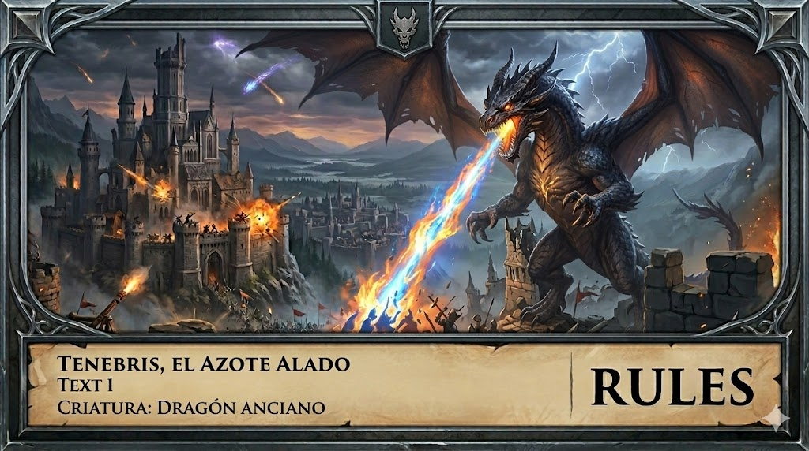

# HEXA: Enciclopedia Multilingüe de Cartas

## Descripción del Dominio
La aplicación será un catálogo interactivo de cartas de un TCG (real o inventado). El objetivo es que los jugadores puedan explorar la base de datos completa, ver las estadísticas de cada carta y gestionar su propia lista de "Deseos" o "Favoritos" para armar mazos a futuro.

## Funcionalidades Principales

### 🏠 Exploración (Home)
*   **Grilla de cartas (cards):** Muestra la ilustración, el nombre y el costo de energía/maná.
*   **Scroll Infinito:** A medida que el usuario baja, se cargan más cartas consumiendo **MockAPI**.
*   **Buscador:** Filtrado por nombre de la carta directamente desde la API.

### 🃏 Detalle de la Carta (Details)
*   **Vista en Alta Resolución:** Al hacer clic, se muestra la carta con todo su detalle.
*   **Información Detallada:** Texto de habilidad (lore), estadísticas (ATK/DEF), artista y edición.
*   **Manejo de Errores:** Si el usuario ingresa un ID inexistente en la URL, se redirige a una **página 404**.

### ❤️ Colección Personal (Favoritos)
*   **Gestión:** Botón de "Agregar a Favoritos" (ícono de estrella o corazón) en cada carta.
*   **Persistencia:** Uso de **LocalStorage** para que la selección no se pierda al cerrar el navegador.

## Especificaciones Técnicas

### 🌎 Internacionalización (i18n)
*   Soporte completo para **Español e Inglés**.
*   Selector de idioma en el Header.
*   Persistencia de la preferencia de idioma del usuario.

### 🎨 Interfaz (UI/UX)
*   Diseño moderno utilizando **Tailwind CSS**.
*   Header **sticky** para navegación rápida.
*   Footer con redes sociales ficticias del juego.

## 🖼️ Arte Conceptual
Aquí se encuentran los diseños principales de los personajes y la portada del juego:

*   **Portada:** 
*   **Grak:** 
*   **Lyra:** 
*   **Sir Kaelen:** 
*   **Tenebris:** 
