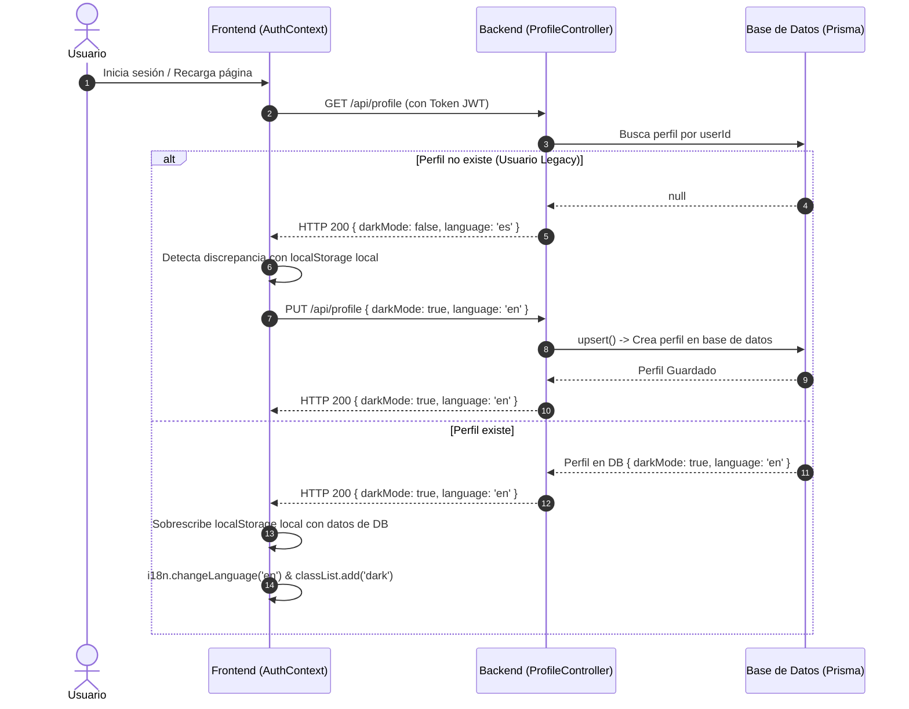
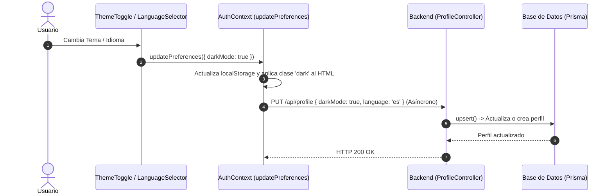

# Design: us-107-profile-integration

Este diseño detalla la arquitectura técnica, la estructura del servicio de API y la lógica de sincronización estado-servidor tanto para el frontend (React) como para el backend (Express/Prisma).

---

## 1. Sequence Diagrams

### 1.1 Sincronización Inicial (Login / Restore)



### 1.2 Cambio en Caliente (Hot Sync)



---

## 2. Technical Architecture & Module Structure

### 2.1 Backend Changes (`tpexpress`)

Modificaremos el servicio del perfil en `tpexpress/src/services/profile.service.js` para usar `prisma.profile.upsert` de modo que maneje de forma transparente usuarios sin perfil.

```javascript
// tpexpress/src/services/profile.service.js
export async function updateProfile(userId, data) {
  return prisma.profile.upsert({
    where: { userId },
    update: data,
    create: {
      userId,
      darkMode: data.darkMode ?? false,
      language: data.language ?? 'es'
    }
  });
}
```

### 2.2 Frontend API Service (`pwatpo2react2/src/services/profileService.js`)

Crearemos el servicio de conexión a la API utilizando el cliente HTTP existente:

```javascript
import apiClient from './apiClient';

const profileService = {
  getProfile: async () => {
    try {
      return await apiClient.get('/profile');
    } catch (error) {
      console.error('Error fetching user profile:', error);
      throw new Error(`Error fetching user profile: ${error.message}`);
    }
  },

  updateProfile: async (data) => {
    try {
      return await apiClient.put('/profile', data);
    } catch (error) {
      console.error('Error updating user profile:', error);
      throw new Error(`Error updating user profile: ${error.message}`);
    }
  }
};

export default profileService;
```

### 2.3 Sincronización Unificada en `AuthContext.jsx`

Añadiremos dos métodos principales internos en `AuthProvider`:
*   `syncProfile(userToken)`: Lógica ejecutada en `restoreSession` y al finalizar el `login` para reconciliar preferencias.
*   `updatePreferences(updates)`: Función expuesta en el valor del Provider para realizar los cambios locales y remotos unificados.

```javascript
const updatePreferences = async (updates) => {
  const currentTheme = preferencesService.getTheme();
  const currentLang = preferencesService.getLanguage();

  const nextTheme = updates.darkMode !== undefined 
    ? (updates.darkMode ? 'dark' : 'light') 
    : currentTheme;

  const nextLang = updates.language !== undefined 
    ? updates.language 
    : currentLang;

  // 1. Aplicación local inmediata
  if (updates.darkMode !== undefined) {
    preferencesService.setTheme(nextTheme);
    if (nextTheme === 'dark') {
      document.documentElement.classList.add('dark');
    } else {
      document.documentElement.classList.remove('dark');
    }
  }

  if (updates.language !== undefined) {
    preferencesService.setLanguage(nextLang);
    // Cambiar lenguaje en i18next
    i18n.changeLanguage(nextLang);
  }

  // 2. Propagación al servidor si está logueado
  if (user) {
    try {
      await profileService.updateProfile({
        darkMode: nextTheme === 'dark',
        language: nextLang
      });
    } catch (error) {
      console.error('Failed to sync preferences to remote server:', error);
    }
  }
};
```

---

## 3. Test Design

*   **`profileService.test.js`**: Pruebas unitarias para validar las peticiones GET y PUT de `profileService` utilizando mocks de `apiClient`.
*   **`AuthContext.test.jsx`**: Incorporará pruebas para:
    *   Verificar que `login` llama a `getProfile` y sincroniza las preferencias.
    *   Verificar que `restoreSession` lee el perfil y lo sincroniza correctamente en el cliente.
    *   Probar que `updatePreferences` actualiza el backend si el usuario está autenticado, pero solo actualiza localmente si es anónimo.
*   **`ThemeToggle.test.jsx` & `LanguageSelector.test.jsx`**: Adaptar los tests existentes para mockear el contexto de autenticación en caso de que consuman `updatePreferences`.
