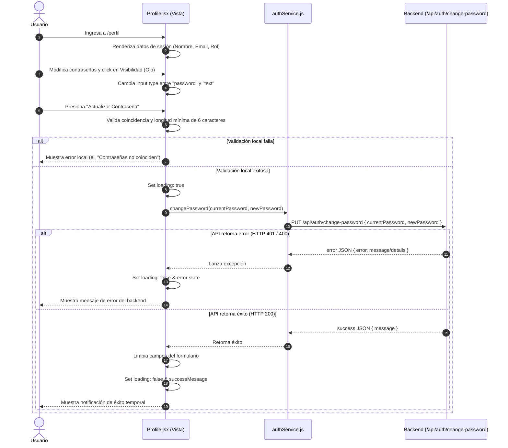

# Design: us-112-change-password-and-visibility

Este documento define la arquitectura técnica, las modificaciones de componentes y el diseño de la interfaz de usuario para implementar la vista de perfil y la funcionalidad de cambio de contraseña en HEXA.

---

## 1. Sequence Diagram



---

## 2. Technical Architecture & Module Structure

### 2.1 API Service Extension (`src/services/authService.js`)
Agregaremos el método `changePassword` que consume el endpoint PUT del backend:
```javascript
changePassword: async (currentPassword, newPassword) => {
  try {
    return await apiClient.put('/auth/change-password', { currentPassword, newPassword });
  } catch (error) {
    console.error('Error in authService.changePassword:', error);
    const err = new Error(`Error in changePassword: ${error.message}`);
    err.status = error.status;
    throw err;
  }
}
```

### 2.2 Profile View Structure (`src/pages/Profile.jsx`)
La vista se estructurará con:
1.  **Panel de Información de Cuenta**: Datos de solo lectura obtenidos directamente del `AuthContext`.
2.  **Formulario de Cambio de Contraseña**:
    *   Campos con botones flotantes a la derecha del input para conmutar el tipo de input.
    *   Lógica para alternar visibilidad de manera independiente:
        ```jsx
        const [showCurrent, setShowCurrent] = useState(false);
        const [showNew, setShowNew] = useState(false);
        const [showConfirm, setShowConfirm] = useState(false);
        ```
    *   Visualización de mensajes de error de forma bilingüe mediante clases dinámicas de Tailwind (`text-red-500`, `bg-red-500/10`).
    *   Animaciones suaves de éxito con un banner de alerta transicional.

### 2.3 Integration with i18n Locales
Se añadirán las siguientes traducciones en `src/i18n/locales/es.json` y `en.json`:
*   `nav.profile`: "Perfil" / "Profile"
*   `profile.title`: "Mi Perfil" / "My Profile"
*   `profile.subtitle`: "Gestioná la seguridad y configuraciones de tu cuenta." / "Manage your account security and settings."
*   `profile.infoTitle`: "Datos del Usuario" / "User Information"
*   `profile.name`: "Nombre" / "Name"
*   `profile.email`: "Correo Electrónico" / "Email Address"
*   `profile.role`: "Rol de Cuenta" / "Account Role"
*   `profile.securityTitle`: "Cambiar Contraseña" / "Change Password"
*   `profile.currentPassword`: "Contraseña Actual" / "Current Password"
*   `profile.newPassword`: "Nueva Contraseña" / "New Password"
*   `profile.confirmPassword`: "Confirmar Nueva Contraseña" / "Confirm New Password"
*   `profile.submit`: "Actualizar Contraseña" / "Update Password"
*   `profile.updating`: "Actualizando..." / "Updating..."
*   `profile.success`: "Contraseña actualizada exitosamente" / "Password updated successfully"
*   `profile.errors.required`: "Todos los campos son obligatorios" / "All fields are required"
*   `profile.errors.tooShort`: "La nueva contraseña debe tener al menos 6 caracteres" / "The new password must be at least 6 characters"
*   `profile.errors.mismatch`: "Las contraseñas no coinciden" / "Passwords do not match"

---

## 3. Test Design

*   **`authService.test.js`**:
    *   Añadir pruebas unitarias mockeando `globalThis.fetch` para validar peticiones `PUT` correctas y manejo de errores (HTTP 401 / 400).
*   **`Profile.test.jsx`**:
    *   *Caso 1: Carga básica.* Comprobar que renderiza los datos correctos del usuario autenticado (mock de `useAuth`).
    *   *Caso 2: Alternar visibilidad.* Escribir texto en los inputs, hacer click en los iconos de ojo y verificar que el atributo `type` cambie de `password` a `text` y viceversa de forma independiente.
    *   *Caso 3: Validación del cliente.* Validar longitud mínima de caracteres y que lance error si no coinciden. Comprobar que no llama a `authService.changePassword`.
    *   *Caso 4: Cambio exitoso.* Simular el envío correcto de datos, mockear la respuesta exitosa de la API, y verificar que se limpien los campos y se muestre la alerta de éxito.
    *   *Caso 5: Error en servidor.* Validar que ante credenciales inválidas (401) se renderice el mensaje de error de la API y se mantengan los datos.
