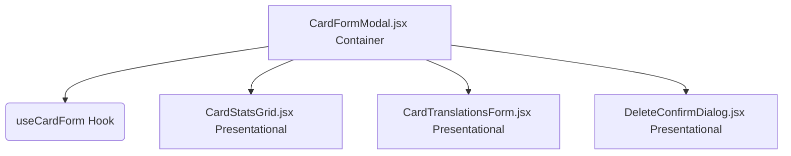

# Diseño Técnico: us-18-cardformmodal-refactor

**Cambio**: us-18-cardformmodal-refactor  
**Fase**: Diseño (sdd-design)  
**Estado**: Listo para revisión  

---

## 1. Arquitectura de Componentes

La estructura modularizada del modal de administración seguirá el siguiente diseño de árbol de componentes:



---

## 2. Especificación de Contratos de Código

### A. Interfaz del Hook `useCardForm.js`

El hook encapsulará la lógica de negocio y la gestión de estado.

#### Firma de entrada:
```javascript
export function useCardForm({ cardId, isOpen, onSuccess, onClose })
```

#### Retorno del hook:
```javascript
return {
  // Estados de carga e interacción
  loading,
  fetching,
  error,
  showDeleteConfirm,
  setShowDeleteConfirm,
  
  // Campos del formulario
  cost, setCost,
  atk, setAtk,
  def, setDef,
  image, setImage,
  typeId, setTypeId,
  rarityId, setRarityId,
  translations,
  
  // Manejadores de eventos
  handleTranslationChange,
  handleSubmit,
  handleDelete,
};
```

### B. Props de `CardStatsGrid.jsx`

El grid de estadísticas se aislará en un componente de presentación puro. Recibe los valores y setters individuales de estado.

```javascript
export default function CardStatsGrid({
  cost,
  setCost,
  atk,
  setAtk,
  def,
  setDef,
  image,
  setImage,
  typeId,
  setTypeId,
  rarityId,
  setRarityId,
  typeOptions = [],   // Para desacoplamiento de la US17
  rarityOptions = [], // Para desacoplamiento de la US17
})
```

### C. Props de `CardTranslationsForm.jsx`

Se encarga de renderizar los bloques de traducción bilingües.

```javascript
export default function CardTranslationsForm({
  translations,
  onTranslationChange, // Callback: (lang, field, value) => void
})
```

### D. Props de `DeleteConfirmDialog.jsx`

Maneja el diálogo flotante de confirmación de borrado.

```javascript
export default function DeleteConfirmDialog({
  isOpen,
  onClose,
  onConfirm,
  loading,
  cardName,
})
```

---

## 3. Bosquejo de CardFormModal.jsx Refactorizado

El componente contenedor se simplificará drásticamente a esta estructura declarativa limpia:

```javascript
import { useTranslation } from 'react-i18next';
import Modal from './Modal';
import LoadingSpinner from './LoadingSpinner';
import CardStatsGrid from './CardStatsGrid';
import CardTranslationsForm from './CardTranslationsForm';
import DeleteConfirmDialog from './DeleteConfirmDialog';
import { useCardForm } from '../hooks/useCardForm';
import { CARD_TYPES, CARD_RARITIES } from '../constants/cardConstants';

export default function CardFormModal({ isOpen, cardId, onClose, onSuccess }) {
  const { t } = useTranslation();
  
  const form = useCardForm({ cardId, isOpen, onSuccess, onClose });

  if (!isOpen) return null;

  return (
    <Modal
      isOpen={isOpen}
      onClose={onClose}
      title={cardId ? t('card.admin.editTitle') : t('card.admin.createTitle')}
    >
      {form.fetching ? (
        <div className="flex justify-center py-8">
          <LoadingSpinner />
        </div>
      ) : (
        <form onSubmit={form.handleSubmit} data-testid="form-card" className="space-y-6">
          {form.error && (
            <div className="rounded-xl border border-red-800 bg-red-950/40 p-4 text-sm text-red-300">
              {form.error}
            </div>
          )}

          <CardStatsGrid
            cost={form.cost} setCost={form.setCost}
            atk={form.atk} setAtk={form.setAtk}
            def={form.def} setDef={form.setDef}
            image={form.image} setImage={form.setImage}
            typeId={form.typeId} setTypeId={form.setTypeId}
            rarityId={form.rarityId} setRarityId={form.setRarityId}
            typeOptions={CARD_TYPES}
            rarityOptions={CARD_RARITIES}
          />

          <CardTranslationsForm
            translations={form.translations}
            onTranslationChange={form.handleTranslationChange}
          />

          {/* Botones de acción del modal */}
          <div className="flex items-center justify-between border-t border-slate-800 pt-4">
            <div>
              {cardId && (
                <button
                  type="button"
                  data-testid="btn-delete"
                  onClick={() => form.setShowDeleteConfirm(true)}
                  className="rounded-xl border border-red-500/20 bg-red-600/10 px-4 py-3 text-sm font-semibold text-red-500 transition-all hover:bg-red-600/20"
                  disabled={form.loading}
                >
                  {t('card.admin.delete')}
                </button>
              )}
            </div>
            <div className="flex gap-3">
              <button
                type="button"
                onClick={onClose}
                className="rounded-xl bg-slate-800 px-4 py-3 text-sm font-semibold text-slate-300 transition-all hover:bg-slate-700"
                disabled={form.loading}
              >
                {t('card.admin.cancel')}
              </button>
              <button
                type="submit"
                className="rounded-xl bg-linear-to-r from-blue-600 to-purple-600 px-5 py-3 text-sm font-semibold text-white shadow-md transition-all hover:from-blue-700 hover:to-purple-700 active:scale-95 disabled:opacity-50"
                disabled={form.loading}
              >
                {form.loading ? (
                  <div className="h-5 w-5 animate-spin rounded-full border-2 border-white border-t-transparent" />
                ) : (
                  t('card.admin.save')
                )}
              </button>
            </div>
          </div>
        </form>
      )}

      <DeleteConfirmDialog
        isOpen={form.showDeleteConfirm}
        onClose={() => form.setShowDeleteConfirm(false)}
        onConfirm={form.handleDelete}
        loading={form.loading}
        cardName={form.translations[t('card.admin.language') || 'es']?.name || form.translations.es.name}
      />
    </Modal>
  );
}
```

---

## 4. Diseño de Pruebas (TDD)

### Pruebas Unitarias de `useCardForm.test.js`
Crearemos las siguientes pruebas aisladas usando `renderHook`:
- `debería inicializar los estados vacíos al montarse en modo alta`
- `debería llamar a cardService.getCardForEdit y poblar los estados en modo edición`
- `debería resetear los estados cuando isOpen cambia de false a true en modo alta`
- `debería validar campos y llamar a cardService.createCard al enviar en modo alta`
- `debería llamar a cardService.updateCard al enviar en modo edición`
- `debería llamar a cardService.deleteCard al confirmar la eliminación`

### Pruebas de Subcomponentes
- Validaremos en pruebas específicas que `CardStatsGrid` y `CardTranslationsForm` respondan correctamente a eventos de cambio y propaguen callbacks al padre.
