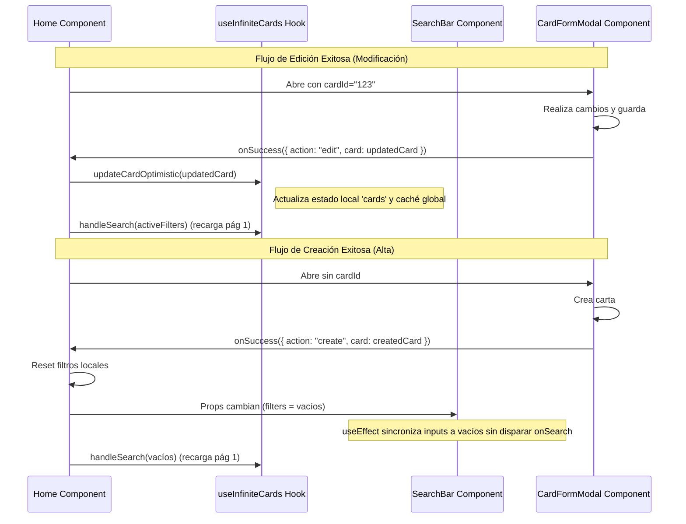

# Diseño Técnico: us-19-post-abm-filter-sync

**Cambio**: us-19-post-abm-filter-sync  
**Fase**: Diseño (sdd-design)  
**Estado**: Listo para revisión  

---

## 1. Diseño de Arquitectura

El flujo propuesto para la sincronización y actualización optimista sigue la siguiente secuencia de interacciones:



---

## 2. Contratos de Código y Cambios Detallados

### A. Modificaciones en [SearchBar.jsx](file:///C:/Work/Uncoma/PWA/pwatpo2react2/src/components/SearchBar.jsx)
Añadimos la prop `filters` y configuramos un `useEffect` para escuchar cambios. Para evitar bucles de actualización, guardamos referencias del estado interno actual y solo sincronizamos si hay diferencias.

```javascript
// Props
export default function SearchBar({
  onSearch,
  typeOptions = [],
  rarityOptions = [],
  debounceMs = 300,
  filters = null, // Nueva prop opcional
}) {
  // ... estados locales ...

  // Efecto para sincronizar props con el estado interno
  useEffect(() => {
    if (!filters) return;
    
    const { searchTerm: propSearch = '', selectedTypes: propTypes = [], selectedRarities: propRarities = [] } = filters;
    
    // Solo actualizamos el estado interno si realmente es diferente para evitar renders infinitos
    if (propSearch !== searchTerm) {
      setSearchTerm(propSearch);
    }
    
    // Comparación superficial de arrays
    const isTypesDiff = propTypes.length !== selectedTypes.length || !propTypes.every(t => selectedTypes.includes(t));
    if (isTypesDiff) {
      setSelectedTypes(propTypes);
    }
    
    const isRaritiesDiff = propRarities.length !== selectedRarities.length || !propRarities.every(r => selectedRarities.includes(r));
    if (isRaritiesDiff) {
      setSelectedRarities(propRarities);
    }
  }, [filters]);
  
  // ...
}
```

### B. Modificaciones en [CardFormModal.jsx](file:///C:/Work/Uncoma/PWA/pwatpo2react2/src/components/CardFormModal.jsx)
Modificamos la llamada a `onSuccess` en los tres flujos de guardado:
- **handleSubmit (Creación)**:
  ```javascript
  const createdCard = await cardService.createCard(payload);
  showToast(t('card.admin.createSuccess'), 'success');
  if (onSuccess) onSuccess({ action: 'create', card: createdCard });
  ```
- **handleSubmit (Edición)**:
  ```javascript
  const updatedCard = await cardService.updateCard(cardId, payload);
  showToast(t('card.admin.updateSuccess'), 'success');
  if (onSuccess) onSuccess({ action: 'edit', card: updatedCard });
  ```
- **handleDelete (Eliminación)**:
  ```javascript
  await cardService.deleteCard(cardId);
  showToast(t('card.admin.deleteSuccess'), 'success');
  if (onSuccess) onSuccess({ action: 'delete', cardId });
  ```

### C. Modificaciones en [useInfiniteCards.js](file:///C:/Work/Uncoma/PWA/pwatpo2react2/src/hooks/useInfiniteCards.js)
Añadimos y exponemos una función de actualización optimista:
```javascript
const updateCardOptimistic = useCallback((updatedCard) => {
  if (!updatedCard || !updatedCard.id) return;
  
  setCards(prevCards => {
    const newCards = prevCards.map(card => 
      card.id === updatedCard.id ? { ...card, ...updatedCard } : card
    );
    
    // Sincronizamos la caché local
    homeCache.cards = newCards;
    return newCards;
  });
}, []);
```
Se añade al objeto de retorno del hook.

### D. Modificaciones en [Home.jsx](file:///C:/Work/Uncoma/PWA/pwatpo2react2/src/pages/Home.jsx)
1. Definimos un estado local para los filtros de búsqueda que se le pasan al `<SearchBar>`:
   ```javascript
   const [searchFilters, setSearchFilters] = useState({ searchTerm: '', selectedTypes: [], selectedRarities: [] });
   ```
2. Pasamos el nuevo estado como prop a `<SearchBar filters={searchFilters} />`.
3. Al invocar la búsqueda manual desde el buscador (`handleSearch`), actualizamos nuestro estado local además del hook:
   ```javascript
   const handleSearch = useCallback((newFilters) => {
     sessionStorage.removeItem('home_scroll_pos');
     window.scrollTo(0, 0);
     setSearchFilters(newFilters); // Sincroniza estado de filtros en Home
     triggerSearch(newFilters);
   }, [triggerSearch]);
   ```
4. Implementamos el manejador enriquecido del éxito del modal:
   ```javascript
   const handleFormSuccess = useCallback((result) => {
     if (!result) {
       // Fallback de seguridad
       handleSearch({ searchTerm: '', selectedTypes: [], selectedRarities: [] });
       return;
     }
     
     const { action, card, cardId } = result;
     
     if (action === 'create' || action === 'delete') {
       // REQ-1: Limpieza absoluta
       handleSearch({ searchTerm: '', selectedTypes: [], selectedRarities: [] });
     } else if (action === 'edit' && card) {
       // REQ-2: Mantener filtros, actualizar optimista y refrescar catálogo
       updateCardOptimistic(card);
       // Gatillamos la recarga de la página 1 preservando los filtros actuales
       triggerSearch(searchFilters);
     }
   }, [handleSearch, triggerSearch, searchFilters, updateCardOptimistic]);
   ```

---

## 3. Estrategia de Testing (Estricto TDD)

Dado que operamos en **Strict TDD Mode**, la implementación se dividirá en micro-ciclos de Rojo-Verde-Refactor:

### Fase 1: Pruebas unitarias de SearchBar reactivo
Escribiremos pruebas en `SearchBar.test.jsx` para comprobar:
1. Que al cambiar la prop `filters` externamente, el buscador actualiza su input de texto local y sus dropdowns de tipo/rareza.
2. Que al recibir la prop `filters`, **NO** se llame al callback `onSearch` (para evitar loops infinitos).

### Fase 2: Pruebas unitarias de la actualización optimista
Escribiremos pruebas unitarias en `useInfiniteCards.test.jsx` (o directamente integradas en `Home.test.jsx` si el hook no tiene archivo de test propio) para verificar que al llamar a `updateCardOptimistic(card)`, la carta correspondiente en la lista cambie su contenido de forma inmediata sin alterar las demás.

### Fase 3: Pruebas de integración del flujo ABM en Home
Modificaremos/añadiremos pruebas en `Home.test.jsx`:
1. Simular éxito de creación (`action: 'create'`) -> Verificar que los filtros se limpien y se invoque la búsqueda inicial con datos vacíos.
2. Simular éxito de borrado (`action: 'delete'`) -> Verificar que los filtros se limpien y se invoque la búsqueda inicial con datos vacíos.
3. Simular éxito de edición (`action: 'edit'`) -> Verificar que se mantengan los filtros actuales, que la carta se actualice optimistamente y que se recargue la lista sin limpiar el buscador.
