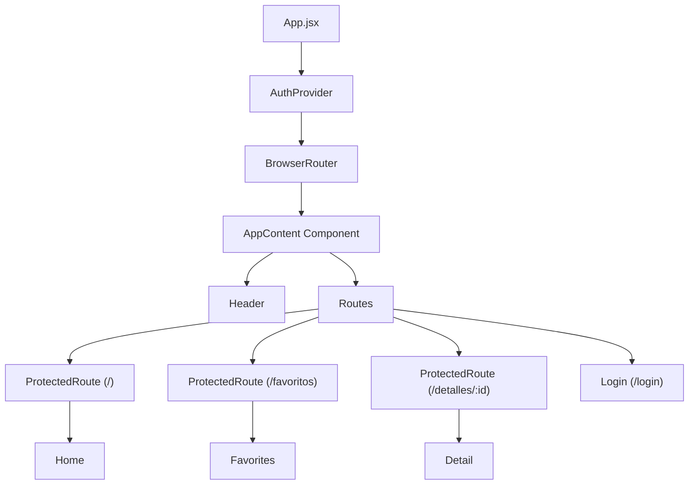

# Design: us-15-auth-flow-corrections

Este documento define la arquitectura técnica, la refactorización de componentes y la estrategia de pruebas para implementar el flujo de navegación de autenticación y protección de rutas en el cliente web de HEXA.

---

## 1. Technical Architecture & Component Structure

### 1.1 Structural Refactoring of App.jsx
Para poder consumir de manera reactiva el estado de autenticación (`useAuth`) y forzar redirecciones automáticas en la carga inicial (`useNavigate`), el componente `App` debe dividirse para que el árbol de componentes principales sea descendiente directo de los providers.



#### Refactored App.jsx Layout:
```jsx
// src/App.jsx
import { BrowserRouter as Router } from 'react-router-dom';
import { AuthProvider } from './context/AuthContext';
import AppContent from './AppContent'; // O declarado inline en App.jsx

export default function App() {
  return (
    <AuthProvider>
      <Router>
        <AppContent />
      </Router>
    </AuthProvider>
  );
}
```

### 1.2 AppContent Component Logic
El nuevo componente `AppContent` contendrá el layout general de la app, el control del Splash Screen y la lógica de redirección inicial:

```jsx
function AppContent() {
  const { t, i18n } = useTranslation();
  const { isAuthenticated, loading } = useAuth();
  const navigate = useNavigate();

  useEffect(() => {
    document.title = t('app.title');
  }, [t, i18n.language]);

  const [showSplash, setShowSplash] = useState(() => {
    return !preferencesService.hasSeenSplashScreen();
  });

  const handleSplashComplete = () => {
    preferencesService.setSplashScreenSeen();
    setShowSplash(false);
  };

  // Redirección obligatoria al Login al cargarse inicialmente si no está logueado
  useEffect(() => {
    if (!showSplash && !loading && !isAuthenticated) {
      navigate('/login', { replace: true });
    }
  }, [showSplash, loading, isAuthenticated, navigate]);

  return (
    <>
      {showSplash && <SplashScreen onComplete={handleSplashComplete} />}
      <div className="flex min-h-screen flex-col bg-slate-50 font-sans text-slate-900 transition-colors duration-500 dark:bg-slate-900 dark:text-slate-100">
        <Header />
        <main className="container mx-auto grow px-4">
          <Routes>
            <Route path="/" element={<ProtectedRoute><Home /></ProtectedRoute>} />
            <Route path="/detalles/:id" element={<ProtectedRoute><Detail /></ProtectedRoute>} />
            <Route path="/favoritos" element={<ProtectedRoute><Favorites /></ProtectedRoute>} />
            <Route path="/login" element={<Login />} />
            <Route path="*" element={<NotFound />} />
          </Routes>
        </main>
        <Footer />
      </div>
    </>
  );
}
```

---

## 2. Modules Specifications

### 2.1 ProtectedRoute Component (`src/components/ProtectedRoute.jsx`)
Encapsulará la validación de la sesión para las rutas restringidas. Evita la exposición de datos y vistas antes de recuperar el JWT.

```jsx
import { Navigate } from 'react-router-dom';
import { useAuth } from '../context/AuthContext';
import LoadingSpinner from './LoadingSpinner';

export default function ProtectedRoute({ children }) {
  const { isAuthenticated, loading } = useAuth();

  // Mostrar spinner temático mientras se restaura la sesión (localStorage)
  if (loading) {
    return (
      <div className="flex min-h-[50vh] items-center justify-center">
        <LoadingSpinner />
      </div>
    );
  }

  // Redirigir al Login si no hay token ni usuario autenticado
  if (!isAuthenticated) {
    return <Navigate to="/login" replace />;
  }

  return children;
}
```

### 2.2 Logout Redirection in Header (`src/components/Header.jsx`)
Modificaremos los manejadores de eventos onClick de logout de la barra de navegación:
*   En desktop:
    ```jsx
    const handleLogout = async () => {
      await logout();
      navigate('/login');
    };
    ```
*   En mobile:
    ```jsx
    const handleMobileLogout = async () => {
      await logout();
      closeMenu();
      navigate('/login');
    };
    ```

---

## 3. Test Strategy

### 3.1 Unit Testing: ProtectedRoute.test.jsx
Crearemos pruebas unitarias completas en `src/components/ProtectedRoute.test.jsx` utilizando Vitest y `@testing-library/react`.
*   **Caso 1: Estado de carga activa.** Mockear `useAuth` con `loading: true`. Comprobar que renderiza el componente `LoadingSpinner`.
*   **Caso 2: Usuario no autenticado.** Mockear `useAuth` con `isAuthenticated: false, loading: false`. Comprobar que renderiza el componente `<Navigate to="/login" replace />` de react-router.
*   **Caso 3: Usuario autenticado.** Mockear `useAuth` con `isAuthenticated: true, loading: false`. Comprobar que renderiza correctamente sus hijos (e.g., un `<div>Child Content</div>`).

### 3.2 Regression Mitigation
Debido a que ahora `Home` y otras páginas requieren autenticación, los tests de integración y de vistas (`App.test.jsx`, `Header.test.jsx`, etc.) que asumen acceso público deben ser adaptados mockeando el comportamiento de `useAuth` (que ya está mockeado en Header y Login, pero debe verificarse en el resto de los archivos de prueba).
